# Blockchain

## What is a Blockchain?

A **blockchain** is a continuously growing list of records, called **blocks**, which are linked and secured using **cryptography**.

Simplistic view of a block:

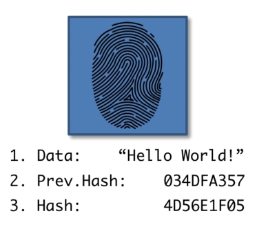

Think of a **hash** as a digital fingerprint which is generated from the other block attributes.

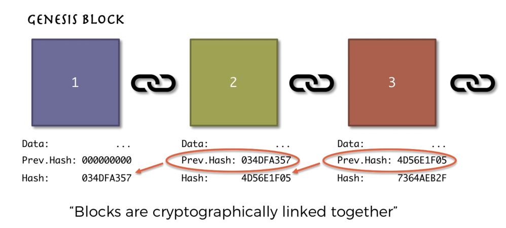

## SHA256 Hash

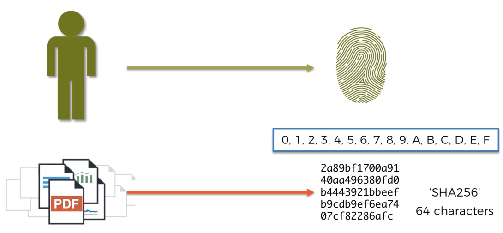

SHA256 = Secure Hash Algorithm of 256 bits where the hash is 64 characters in length.

The hash is only one-way:

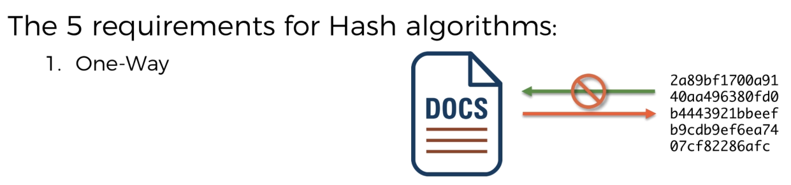

The hash is deterministic i.e. hash a document for a second time and we will get the same hash:

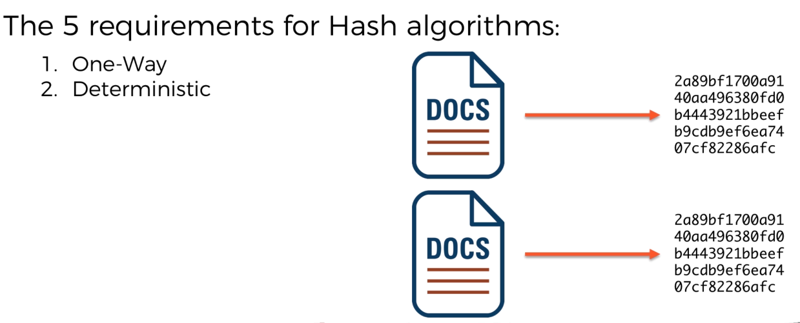

Hash must be fast:

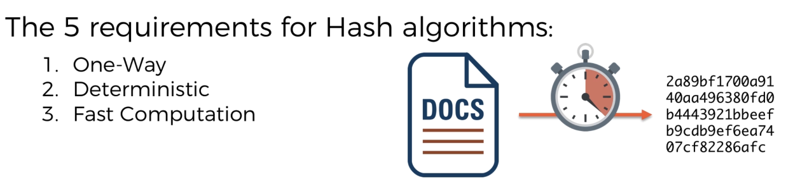

Hash avalanche effect, where even a small change dramatically changes the hash:

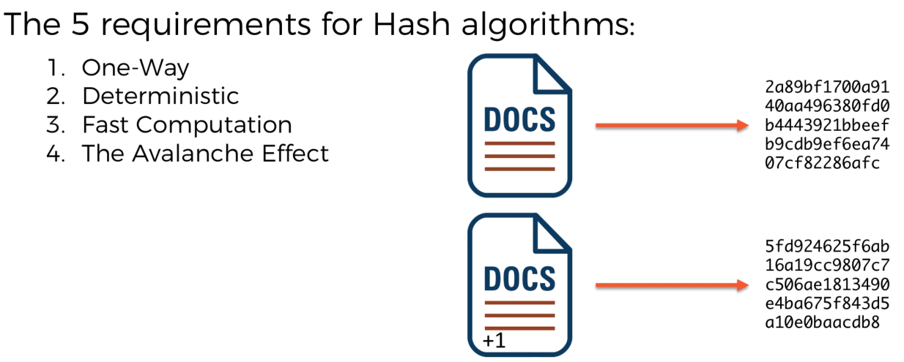

Withstand collisions to avoid faking:

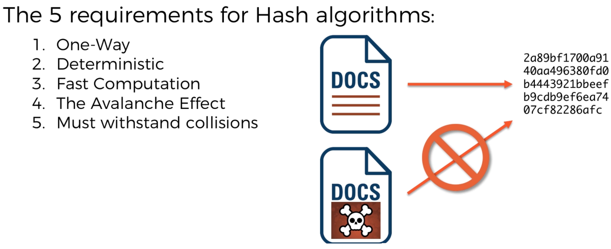

## Immutable Ledger

Example: We buy a house, but once bought how do we prove it is ours? Once paid for our proof is the **deeds** which must be registered with some governing body.

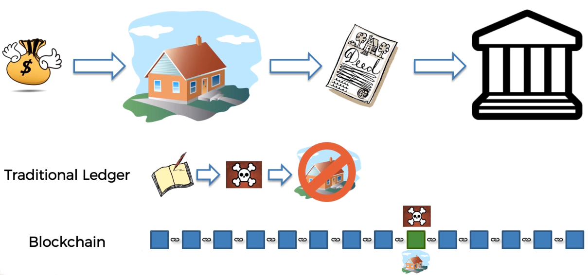

Now what if someone *hacks* the unsecure (traditional ledger) e.g. tipex out some ink or replace an entry in an Excel spreadsheet (if that represents the ledger)? Can someone put their name down as the owner of the home that you bought?

With a blockchain (even at the lowest denominator of not being distributed) we could have a new block (blue square) everytime the deeds of the property has a new owner. There will be lots of blocks for different properties all linked together. Now if anyone tries to replace a block to steal ownership, the chain breaks.

## Distributed P2P Network

The ledger is copied onto multiple computers in the blockchain network. Now maybe a hacker could change one block on one computer and all subsequent blocks because of the change of hash, but the network is talking and this hacked node will be seen as out-of-sync with the consensus:

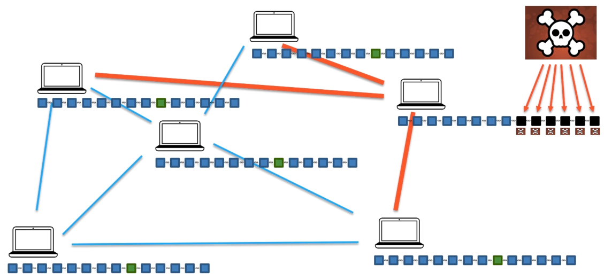

The hacked node can now only accept the correct latest blockchain and so there is no way a hacker would have time to hack at least 51% of all the computers:

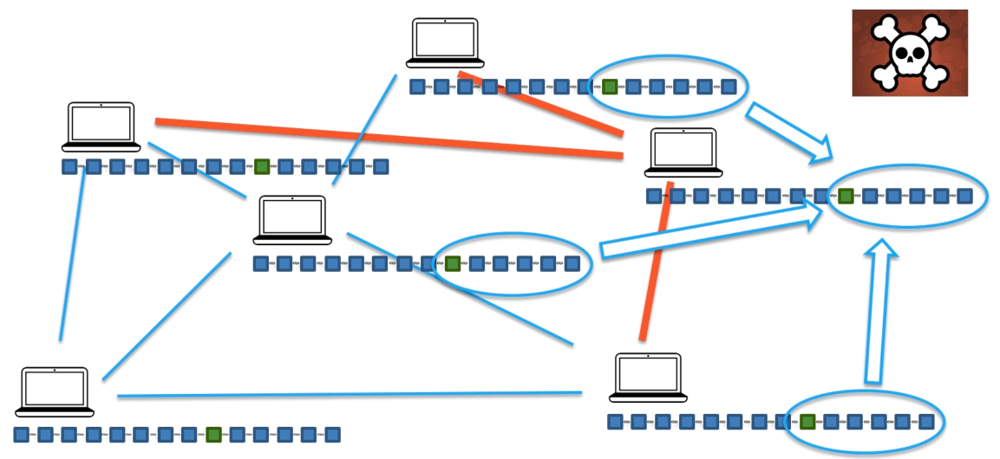

## Mining

Calculating the hash of a block - Take attributes of the block such as; block number; data (bunch of transactions); the previous hash and...

put these into the hashing algorithm (SHA256) to get the hash of the block... and we've mined a coin(s):

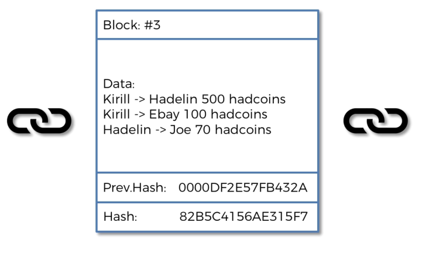

Mmmmm.... That was easy. Too easy. Everyone will mine in an instance. Hackers will have a field day.

Well. We add a **nonce** (number used only once) attribute. We can now change this nonce to change the calculated hash (noting we cannot change any other attribute). i.e. we can't control the hash but we can vary it by changing (trying out) different nonce values.

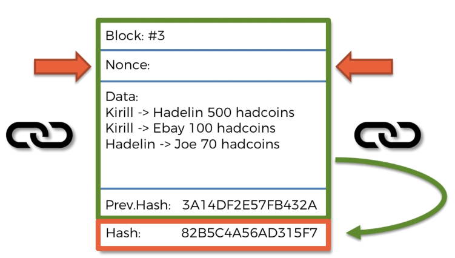

Now then, a hash is just a number, essentially a hexidecimal number, and just like any number we can perform mathematical operations on it such as **increment**.

So let's look at some hashes (in order along with their decimal equivalent):

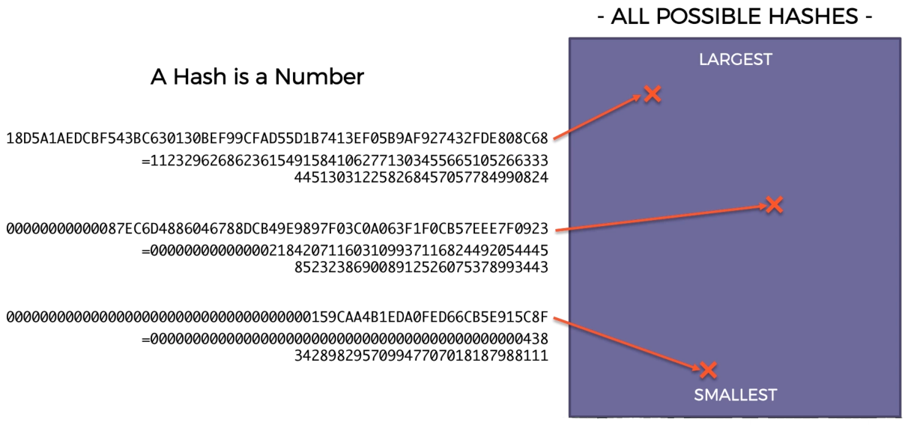

We can be set a "target" of so say 4 leading zeros. Now we can just guess to be quick i.e. we cannot choose a hash with those 4 leading zeros because we need a hash from all attributes including the nonce - we may have done a calculation previously to end up with 4 leading zeros but the nonce and data are specific to a hash.

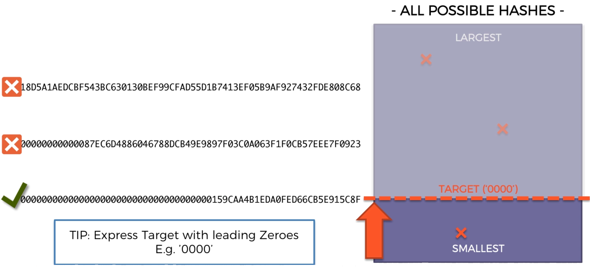

And so we keep changing the nonce until we get a hash below the target:

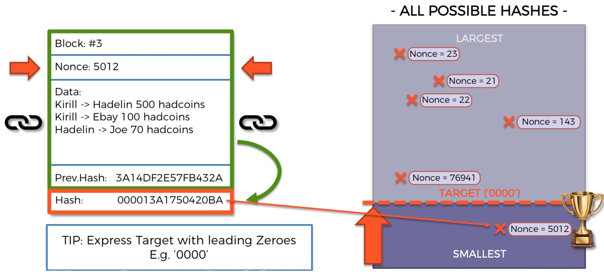

As you can see, because of the avalanche effect, changing the nonce by just 1 number creates a very different hash, so there is no way that a (clever) miner can predict how to hone into the target.